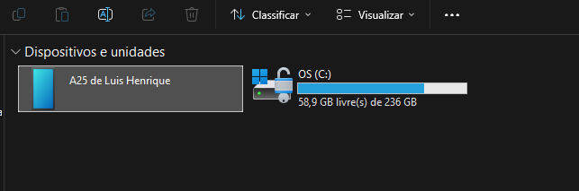

# 📱 Introdução ao Apache Cordova

Apache Cordova é um framework de desenvolvimento mobile que permite criar aplicativos híbridos utilizando tecnologias web como HTML, CSS e JavaScript. Ele fornece acesso a APIs nativas através de plugins, permitindo interações com funcionalidades do dispositivo como câmera, GPS e armazenamento.

- Exemplo simples:

1. Você escreve um código HTML/CSS/JavaScript — ou seja, o aplicativo é basicamente um site.

2. Cordova cria um "wrapper" em torno desse código. Esse wrapper é um aplicativo nativo, mas com uma "webview" (uma janela de navegador embutida), que exibe o seu código web como se fosse um aplicativo.

3. Plugins do Cordova são usados para fazer o "link" entre o código web e as APIs nativas do dispositivo. Por exemplo, se você quer acessar a câmera do celular, o Cordova vai usar um plugin para que seu código web possa acessar a câmera nativa do dispositivo.

---
## 📌 Pré-requisitos

Antes de começar, instale os seguintes softwares:
- [Node.js](https://nodejs.org/)
- [Apache Cordova](https://cordova.apache.org/)

  ```sh
  npm install -g cordova
  ```
- [Android SDK](https://developer.android.com/studio) (para rodar em dispositivos Android)

---
## 🚀 Criando o Projeto
1. Criar um novo aplicativo:
   ```sh
   cordova create meuApp com.exemplo.meuApp "Meu Aplicativo"
   ```
2. Acesse a pasta do projeto:
   ```sh
   cd meuApp
   ```
3. Adicione a plataforma Android:
   ```sh
   cordova platform add android
   ```

---
## ⚡ Principais Comandos

- Listar plataformas suportadas:
  ```sh
  cordova platform list
  ```
- Rodar o app em um emulador ou dispositivo:
  ```sh
  cordova run android
  ```
- Construir o APK:
  ```sh
  cordova build android
  ```

---
## 🛠️ Desenvolvimento do Aplicativo

Desenvolvemos uma calculadora que apenas soma, como forma de teste. Nosso objetivo era ver se a instalação ocorreria com exíto e, com um código básico, ser possivel a instalação do aplicativo no celular android por APK.

Para rodar conseguir usar o Android Studio e conseguir o APK do aplicativo, rode:

```sh
cordova plugin add android
```
Após isso, precisa compilar as alterações:

```sh
cordova build android
```

Execute:
```sh
cordova run android
```

Nosso código em JavaScript foi o seguinte:

```js
function somar() {
    var num1 = parseFloat(document.getElementById('num1').value) || 0;
    var num2 = parseFloat(document.getElementById('num2').value) || 0;
    var resultado = num1 + num2;
    document.getElementById('resultado').innerText = 'Resultado: ' + resultado;
}
```

---
## 📱 Ambiente de Compilação  

O **Apache Cordova** permite que você desenvolva aplicativos móveis usando **HTML, CSS e JavaScript**, mas para transformar esse código em um **APK (aplicativo Android instalável)**, é necessário um ambiente de compilação adequado.  

### 📌 Motivo pelo qual você precisa do Android Studio e SDK Tools  

### 🛠️ 1. Compilação do Código  
O Cordova precisa do **Android SDK** para compilar o código **JavaScript e HTML** em um aplicativo Android. O SDK contém ferramentas como o **Gradle**, que é responsável pela construção do **APK**.  

### 📲 2. Emulador e Dispositivos  
O **Android Studio** inclui o **AVD (Android Virtual Device)**, permitindo testar seu aplicativo em um **emulador** antes de instalá-lo em um dispositivo real.  

### 🔑 3. Assinatura do App  
O Android exige que todos os apps sejam **assinados** antes de serem instalados. O **SDK Tools** contém utilitários como o **Keytool** e **Jarsigner** para esse processo.  

### 📦 4. Gerenciamento de Dependências  
O **Gradle**, que vem com o **Android Studio**, gerencia **bibliotecas** e **dependências** do seu projeto Cordova. Isso garante que tudo esteja atualizado e funcionando corretamente.  

---  
> 💡 **Dica:** Sempre verifique se o Android SDK e as ferramentas necessárias estão corretamente configuradas para evitar erros ao compilar seu aplicativo. 🚀  
 

---
## 📲 Testando no Celular

Após a finalização do código, execute o comando:
```sh
cordova build android
```

Após isso, dentro do seu diretorio hello, vá a esse caminho:
```sh 
cd platforms/android/app/build/outputs/apk/debug
```

Agora, abra seu explorer e vá em "Este Computador". Conecte um cabo USB no computador e conecte no Celular.  

O que você verá sera algo como:




Clique em Armazenamento inteirno:

.png>)

E, adicione o arquivo APK dentro de armazenamento interno:

.png>)

---

## 🚧 Possíveis Problemas e Soluções

- **Erro de SDK não encontrado:** Verifique se o Android SDK está instalado e o caminho configurado.

- **Erro ao rodar no dispositivo:** Certifique-se de que o modo de desenvolvedor está ativado e a depuração USB está permitida.


## 📖 Referências
- [Documentação Oficial](https://cordova.apache.org/docs/en/latest/)
- [Plugins do Cordova](https://cordova.apache.org/plugins/)

## 👥 Equipe
- Vinicius Pires ([vinicinnnn](https://github.com/vinicinnnn))
- Juan Pablo ([JJuanPabl0](https://github.com/JJuanPabl0))
- Luis Henrique ([DarkBytess](https://github.com/DarkBytess))
